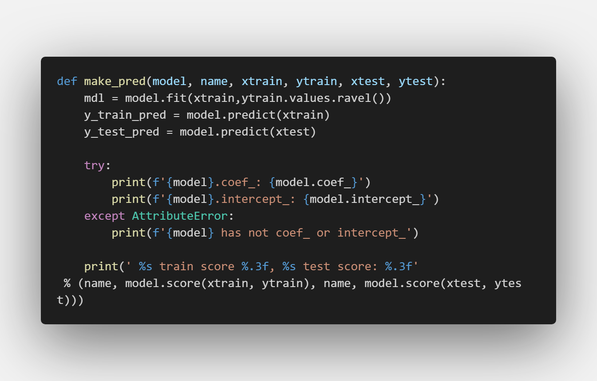
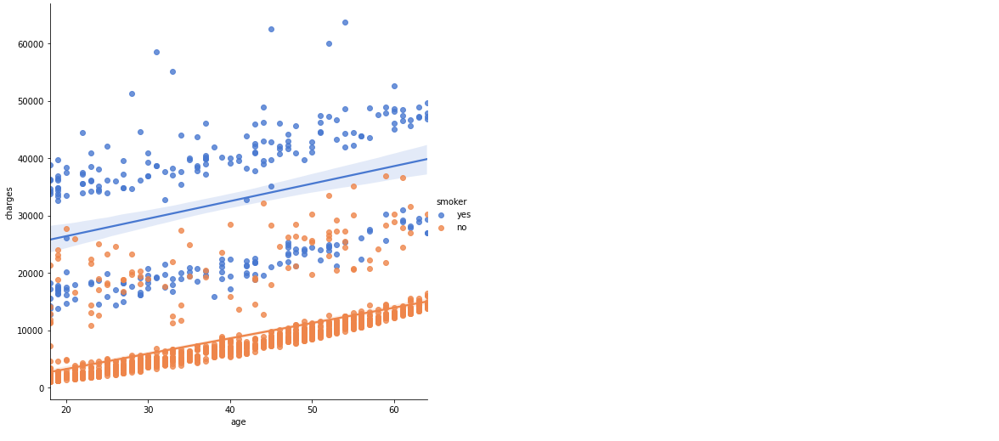

## Python Insurance Predictive ML

  - **Keywords:** [Data Science, MAchine Learning, EDA, Data Visualization, Business Intelligence]()
  - **Used libs:** *Pandas, Sklearn, Seaborn, Matplotlib*

This project is about insurance dataset, exploring the insured and how often they could claim charges for their insurance policies, especially those how dangering their lives or at least threatening their well-being in some ways, maybe a habit of smoking, an activity of having sex (how many children do they have?), or maybe where they live or their age is a major factor in encouraging them to do so. 
It's very interesting to explore and have fun with such a case and to learn more about human behavior when it comes to claiming what could be righteously theirs.

snippets:

